# Final Implementation Plan: Schupy v2.0 Upgrade

This document outlines the exact changes to be made to the `schupy` package. It details every component to be **removed**, **fixed/modified**, and **added**, along with the explicit list of external packages, architecture, and verification plan.

---

## 1. Summary of Actions

```mermaid
graph TD
    A[schupy v1.0] --> B[Removals]
    A --> C[Bug Fixes & Refactoring]
    A --> D[New Scientific Features]
    A --> E[Pure Computational Architecture]

    B --> B1[Remove Cartopy & Map plotting]
    B --> B2[Remove Matplotlib & Spectrum plotting]
    B --> B3[Remove Extended Sources & Randomness]
    B --> B4[Remove Global State]

    C --> C1[Fix s_int in-place mutation]
    C --> C2[Fix assertion logic]
    C --> C3[Fix loop parameter shadowing]
    C --> C4[Rename to B_NS & B_EW]
    C --> C5[Default n_max = 5000]

    D --> D1[Finite Decay Time tau - Bozóki 2025b]
    D --> D2[North-Pole Forward Models]
    D --> D3[Hypergeometric Method - Prácser 2021]

    E --> E1[Modular src layout]
    E --> E2[pyproject.toml packaging]
    E --> E3[numpy + scipy core deps only]
```



---

## 2. Packages Planned to Use

`schupy` will be a **pure scientific computation package** with minimal, robust dependencies:

| Package | Purpose in `schupy` | Justification |
|---|---|---|
| **`numpy`** ($\ge 1.20$) | Multidimensional array operations, vectorized trigonometry, coordinate conversions, Legendre recurrence. | Standard, high-performance numerical computing library. |
| **`scipy`** ($\ge 1.5$) | Specifically `scipy.special.hyp2f1` for evaluating Gauss hypergeometric functions of complex orders. | Required for the exact closed-form solution of the TDTE ([Prácser et al., 2021](file:///d:/ELTE/doktori/Munka/SR/articles/pracser2021_text.txt)). |
| **Python Standard Library** | `dataclasses` / `typing` / `enum` / `math` | Type hints, structured containers, enums with zero overhead. |

> [!NOTE]
> **No GUI / Visualization libraries**: `matplotlib` and `cartopy` are completely removed from dependencies. The package strictly calculates and returns numerical spectra.

---

## 3. Components to REMOVE

| Item | Location / Scope | Reason |
|---|---|---|
| `plot_map()` function | `schupy.py:10–74` | Map plotting removed; eliminates `cartopy` dependency. |
| Spectrum plotting code | `schupy.py:462–498` | Spectrum plotting removed; eliminates `matplotlib` dependency. |
| Plotting parameters | `forward_tdte(mapshow, mapsave, mapfilename, plotshow)` | Removed from function signatures. |
| `extended()` function | `schupy.py:228–315` | Extended source modeling removed as requested. |
| `radius` parameter | `forward_tdte(radius)` | Associated with extended sources. |
| Global variables | `global height`, `s_lon_ext`, `s_lat_ext`, `s_int_ext` | Unsafe shared global state; replaced with explicit parameter passing. |
| `from random import random` | `schupy.py:3` | No longer needed. |
| Unused variables | `nfreq = len(freq)` in height functions | Dead code. |
| Embedded `.pyc` caches | Repository root `__pycache__/` | Obsolete Python 3.6 binaries. |

---

## 4. Components to MODIFY & FIX

### 4.1 Parameter & Variable Naming ($B_\theta, B_\varphi \to B_{NS}, B_{EW}$)
Correct the coil naming convention in all functions and documentation:
- **`B_NS`** (formerly `Bt` / `Btheta`): Field measured by a **North–South oriented induction coil** (meridional component $B_\theta$).
- **`B_EW`** (formerly `Bph` / `Bphi`): Field measured by an **East–West oriented induction coil** (azimuthal component $B_\varphi$).
- `ret` options: `"all"`, `"er"`, `"b_ns"`, `"b_ew"`.

### 4.2 Bug Fixes & Code Cleanliness
- **Input mutation**: Replace in-place `s_int[i] = s_int[i] * 1e6` with `s_int = np.asarray(s_int, dtype=float) * 1e6` to avoid mutating caller data.
- **Input validation**: Fix assertion to `assert len(s_lat) == len(s_lon) and len(s_lat) == len(s_int)`.
- **Parameter shadowing**: In Legendre summations (`greens`, `greens_d`), rename the parameter to `n_max` and loop index to `n`.
- **Legendre summation limit**: Increase default cutoff from $n=500$ to **$n_{\text{max}} = 5000$**.

### 4.3 Height Calculation Verification (Preserved with Modernized Signatures)
The height models were verified against the reference literature and are preserved with clean function signatures:
- `height_mushtak(freq, ...)`: [Mushtak & Williams (2002)](file:///d:/ELTE/doktori/Munka/SR/articles/pechony2004.pdf) (Pechony & Price 2004, Eqs. 6–9).
- `height_kulak(freq)`: [Kulak & Mlynarczyk (2013)](file:///d:/ELTE/doktori/Munka/SR/articles/kulak2013.pdf) (Eqs. 27–34).

---

## 5. Components to ADD

### 5.1 Finite Decay Time for Continuing Currents ([Bozóki et al., 2025b](file:///d:/ELTE/doktori/Munka/SR/articles/bozoki2025b_text.txt))
- Add parameter `tau: float = 0.0` (in seconds) to all forward modeling functions.
- Multiplies the output power spectral density by the current spectrum factor:
  $$|I(\omega)|^2 = \frac{1}{1 + \omega^2 \tau^2}$$
- Default $\tau = 0.0$ corresponds to standard Dirac-delta (impulsive) excitation.

### 5.2 Simplified North-Pole Forward Model (`forward_tdte_pole`)
For configurations where the source is located at the North Pole ($\theta'=0$):
- Great-circle distance $\gamma$ simplifies to observer colatitude $\theta$.
- By rotational symmetry ($\partial V / \partial \varphi = 0$), the meridional field **$B_{NS} \equiv 0$**.
- The non-zero horizontal magnetic field is purely azimuthal (East–West): **$B_{EW} \neq 0$**.
- Signature:
  ```python
  def forward_tdte_pole(
      theta,
      s_int,
      freq,
      n_max=5000,
      h="mushtak",
      tau=0.0,
      ret="all",
  ) -> SRSpectrum: ...
  ```

### 5.3 Hypergeometric Function Approach ([Prácser et al., 2021](file:///d:/ELTE/doktori/Munka/SR/articles/pracser2021_text.txt))
Evaluate the Legendre functions of complex order directly via Gauss hypergeometric function ${}_2F_1$ (`scipy.special.hyp2f1`):
$$\nu(\nu+1) = \frac{\omega^2 R^2}{c^2}\frac{h_m}{h_c}, \quad \nu = -\frac{1}{2} + \sqrt{\frac{1}{4} + \frac{\omega^2 R^2}{c^2}\frac{h_m}{h_c}}$$
$$P_\nu(-\cos\gamma) = {}_2F_1\left(-\nu, \, \nu+1; \, 1; \, \frac{1+\cos\gamma}{2}\right)$$
$$\frac{d P_\nu(-\cos\gamma)}{d(\cos\gamma)} = \frac{\nu(\nu+1)}{2} {}_2F_1\left(1-\nu, \, \nu+2; \, 2; \, \frac{1+\cos\gamma}{2}\right)$$

Functions to add:
- `forward_hyper(s_lat, s_lon, s_int, m_lat, m_lon, freq, h="mushtak", tau=0.0, ret="all") -> SRSpectrum`
- `forward_hyper_pole(theta, s_int, freq, h="mushtak", tau=0.0, ret="all") -> SRSpectrum`

### 5.4 Structured Data Types
- `SRSpectrum`: A lightweight dataclass/namedtuple container holding `(freq, Er, B_NS, B_EW)`.
- `HeightModel`: Enum (`"mushtak"`, `"kulak"`).

---

## 6. Target Package Architecture

```
schupy_repo/
├── pyproject.toml              # Modern PEP 517/621 build configuration
├── README.md                   # Updated documentation with new naming & examples
├── LICENSE
├── .gitignore
└── schupy/
    ├── __init__.py             # Public API surface
    ├── constants.py            # Physical constants (eps0, mu0, R, c)
    ├── types.py                # SRSpectrum, HeightModel
    ├── heights.py              # height_mushtak, height_kulak
    ├── greens.py               # Legendre-sum Green's functions (n_max=5000)
    ├── hyper.py                # Hypergeometric formulation (scipy.special.hyp2f1)
    ├── forward.py              # forward_tdte, forward_tdte_pole
    └── forward_hyper.py        # forward_hyper, forward_hyper_pole
```

### Build & Dependency Specification (`pyproject.toml`)
```toml
[build-system]
requires = ["setuptools>=61.0"]
build-backend = "setuptools.build_meta"

[project]
name = "schupy"
version = "2.0.0"
description = "A python package for modeling Schumann resonances"
readme = "README.md"
requires-python = ">=3.8"
dependencies = [
    "numpy>=1.20",
    "scipy>=1.5"
]
```

---

## 7. Public API Summary

| Function | Method / Reference | Returns | Description |
|---|---|---|---|
| `forward_tdte(...)` | Legendre series ($n=5000$), Bozóki 2019 | `SRSpectrum(Er, B_NS, B_EW)` | General arbitrary source-observer forward model |
| `forward_tdte_pole(...)` | Legendre series ($n=5000$), Bozóki 2025b | `SRSpectrum(Er, 0, B_EW)` | Fast axisymmetric model (source at North Pole, $B_{NS}=0$) |
| `forward_hyper(...)` | Hypergeometric ${}_2F_1$, Prácser 2021 | `SRSpectrum(Er, B_NS, B_EW)` | Exact closed-form uniform cavity forward model |
| `forward_hyper_pole(...)` | Hypergeometric ${}_2F_1$, Prácser 2021 | `SRSpectrum(Er, 0, B_EW)` | Exact closed-form with pole source ($B_{NS}=0$) |

---

## 8. Verification Plan

Once approved, the implementation will be verified through the following checks:

1. **Analytical Consistency Check**:
   - Verify that `forward_tdte` and `forward_hyper` produce identical spectra across the 5–40 Hz band within numerical precision.
2. **Polar Symmetry Check**:
   - Verify that `forward_tdte_pole(theta, ...)` matches `forward_tdte(s_lat=90, s_lon=0, m_lat=90-theta, m_lon=0, ...)` with $B_{NS} = 0$ and $B_{EW} \neq 0$.
3. **Decay Time Benchmark ([Bozóki et al., 2025b](file:///d:/ELTE/doktori/Munka/SR/articles/bozoki2025b_text.txt))**:
   - Run forward models with $\tau = 0, 10, 20, 50$ ms and verify the progressive reddening of the spectra matching Figures 2–6.
4. **Legendre Convergence Benchmark ([Bozóki et al., 2019](file:///d:/ELTE/doktori/Munka/SR/articles/bozoki2019_text.txt))**:
   - Verify convergence behaviour up to $n=5000$.
